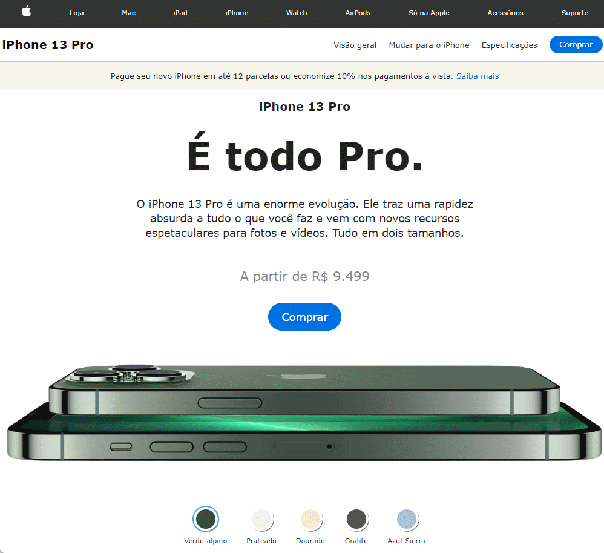

    <h1> iPhone 13 Pro</h1>
      <h3>Clone Página IPhone 13 Pro</h3>

</img>

    
Meu interesse em estudo foi algumas funcionalidades como
manipulação de src com JavaScript , transição de cores e adaptação Mobile com Media Queries.

---

<h3>Créditos :</h3>

- Matheus Battisti : [GitHub](https://github.com/matheusbattisti)
- Curso Udemy : [HTML e CSS: O Início](https://www.udemy.com/course/html-e-css-o-inicio/learn/lecture/34205954?start=615#overview)
- Hora de Codar : [Site](https://horadecodar.com.br/)
- Canal : [Youtube](https://www.youtube.com/channel/UCDoFiMhpOnLFq1uG4RL4xag)

---

© Released under the [MIT License](https://github.com/Coffejs/Iphone13/blob/main/LICENSE).
Copyright (c) 2023 GitHub, @Coffejs!.

